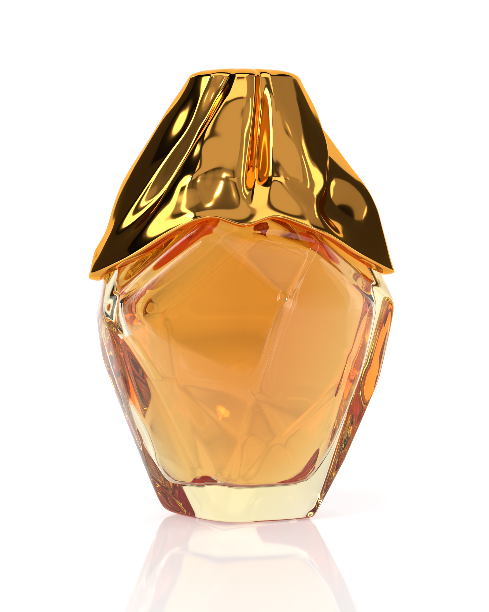

# AURA Flakon in Blender

Fotorealistisches 3D-Modell des AURA-Flakons in der Bernstein-Variante: facettierter Glaskörper mit dicker Wand und Parfum, darüber eine drapierte Kappe aus poliertem Gold. Die Szene wird komplett vom Skript `aura_flacon.py` erzeugt: Modell, Materialien, Studiolicht, Kamera und Render-Einstellungen.



## Dateien

| Datei                               | Inhalt                                                        |
| ----------------------------------- | ------------------------------------------------------------- |
| `aura_flacon.blend`                 | fertige Szene, direkt in Blender öffnen (HDRI ist eingepackt) |
| `aura_flacon.py`                    | erzeugt die Szene von Grund auf                               |
| `renders/aura_flacon_bernstein.png` | finales Rendering, 1600 × 2000 px                             |

## Öffnen und rendern

Blender 4.2 oder neuer, Render-Engine Cycles. In `aura_flacon.blend` ist alles eingestellt, ein Klick auf **Render → Render Image** (F12) genügt. Auf einer Grafikkarte geht das deutlich schneller: unter _Render Properties → Device_ auf **GPU Compute** umstellen.

Szene neu erzeugen oder Varianten rendern:

```bash
# .blend neu schreiben und final rendern (1600 × 2000, 256 Samples)
blender -b -P blender/aura_flacon.py -- --blend blender/aura_flacon.blend

# schnelle Vorschau
blender -b -P blender/aura_flacon.py -- --out vorschau.png --samples 32 --res 480 600
```

Beim ersten Lauf lädt das Skript die Studio-HDRI `studio_small_09` von [Poly Haven](https://polyhaven.com/a/studio_small_09) (CC0) nach `blender/hdri/`.

## Was wo steckt

- **Form des Glases:** `OUTER_PROFILE` (halbe Breite über der Höhe, aus der Silhouette des Referenzbilds gemessen), `DEPTH`, `WIDTH`. Die Facetten entstehen aus einer konvexen Hülle zufällig versetzter Punkte, der Startwert steht in `build_glass(seed=7)`. Andere Startwerte ergeben andere Schliffe.
- **Kappe:** `RIM` (Höhe der gewellten Unterkante rundum), `FOLDS` und `LUMPS` (Falten und Dellen), `TOP_HALF` (Deckfläche).
- **Farben:** `mat_liquid()` für das Parfum, `mat_glass()` für die Glastönung, `mat_gold()` für die Kappe. Für die Rosé- oder Bordeaux-Variante genügt es, die Farbe der Volume-Absorption im Parfum zu ändern.
- **Licht:** Leuchtflächen mit fester Leuchtdichte (`LIGHT`), eine selbstleuchtende Hohlkehle als Hintergrund und eine Studio-HDRI für die Spiegelungen. Die Kamera sieht reines Weiß wie bei einem freigestellten Produktfoto. Glas und Gold spiegeln eine gedämpftere Umgebung (`STUDIO_INDIRECT`), damit die Farben satt bleiben.
